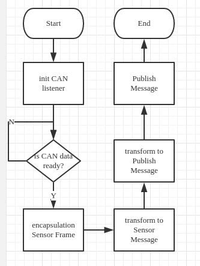
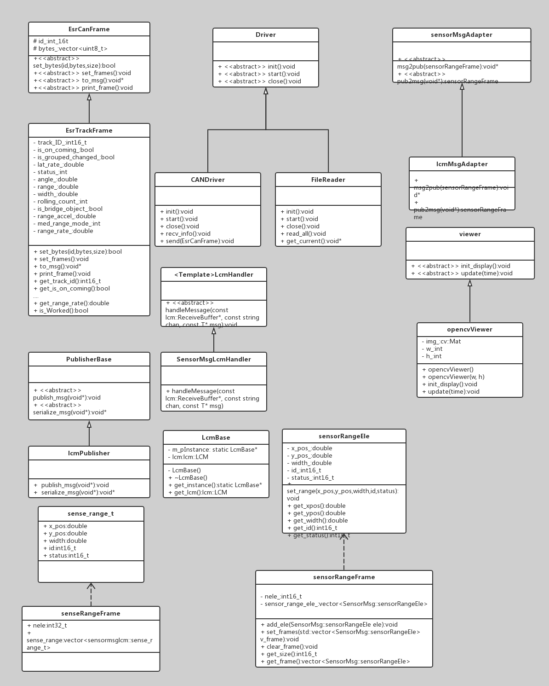
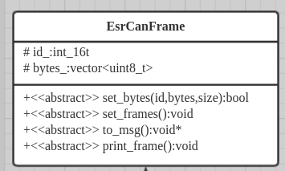
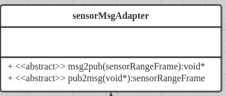
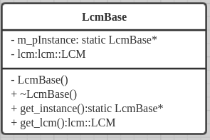
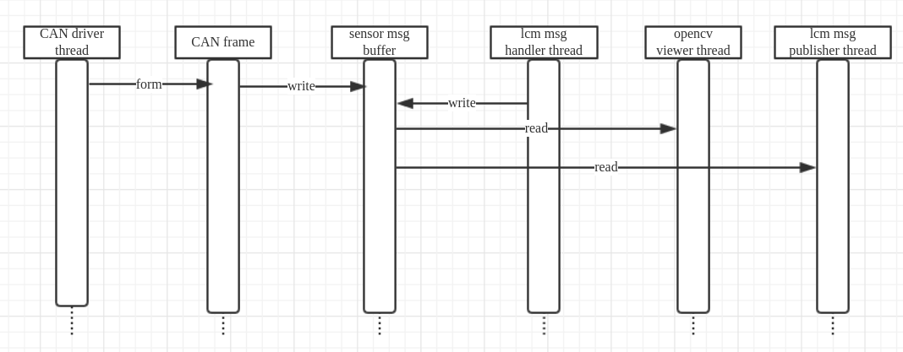

# 面向对象课程设计-障碍检测系统
## 1. 系统功能与需求说明
本系统用于基于CAN总线传感器的障碍检测与基于以太网的分布式显示；并提供CAN总线帧的导出与回播功能。本系统主要满足对多种车载障碍检测传感器的结果解析、融合与调试需求。目前，系统仅支持Delphi ESR毫米波雷达的结果解析、CANalyst II USB CAN转换器驱动、基于LCM的分布式以太网消息分发、及基于OpenCV的障碍物显示。但通过面向对象的特性，协作者、用户可通过简单修改支持其他传感器、其他厂家CAN解析器、订阅者模式的消息分发机制、显示机制。本设计主要基于车载Linux系统，主要部分没有GUI图形界面，也不像信息管理系统有注册、登录的需求，仅使用了图形界面用于障碍物显示以供提调试；同时使用面向对象继承、封装、多态、动态绑定的思想支持传感器、CAN转接器、消息分发器的拓展。

本系统主要包含下列模块：CAN Sensor Driver, CAN Frame, Sensor Message, Publisher, Handler, Viewer。

## 2. 用例析取
经过对障碍检测系统的需求分析，析取用例如下：	
### 2.1 传感器原始数据 CAN帧获取：
简述：用户需初始化，并打开相关CAN总线分析设备，用于监听CAN总线数据，并在监听函数中对相应信息解析、封装成自定义的传感器数据帧
### 2.2 传感器数据解析与传感器消息封装：
简述：用户解析传感器数据帧中有效的障碍信息，并封装成障碍传感器信息。	
### 2.3 传感器消息发布：
简述：用户在得到统一的障碍传感器消息后，可通过消息发布器进行消息的发布。
### 2.4 传感器消息订阅：
简述：基于订阅者模式与分布式设计，用户可在其他节点进行消息的订阅、收集和处理。
### 2.5 传感器数据可视化：
简述：用户可对障碍传感器消息进行可视化操作，可在完成传感器消息封装后或收集到订阅消息后进行。
### 2.6 术语表：
1. CAN帧：结构包括`CAN ID，长度， 及若干个字节`,通常长度为8,后面8个字节
2. 障碍传感器消息：经过统一封装的障碍传感器消息，包含障碍所在具体位置，甚至是大小等信息。
3. 发布型传感器消息：即第三方消息发布、订阅所支持的消息格式。


## 3. 架构设计
本系统主要使用面向对象的简单事件驱动架构；以及主要使用面向过程的变换型系统架构用于传感器数据、传感器消息及发布消息间的变换型处理。整个系统分为两个部分，消息事件生成与消息事件处理。在消息事件生成及处理的过程中，需要根据需要数据结构的需要采用变换型系统架构进行变换。经分析，系统架构如下图所示。	

	图3-1：事件驱动架构图    
      图3-2：数据变换流程图   

## 4. 类及其接口设计
### 4.1 确定设计类
经过分析,本系统析取类如下：	
    图4-1：UML类图  
### 4.2 抽象类接口设计
本系统在每个模块中都提供了抽象类接口；其他类可通过调用接口获得对应的服务，而与具体类实现解耦合。经过分析，本障碍检测系统抽象类设计如下：	

  图4-2：Driver抽象类图     
驱动抽象类，提供初始化、开始监听、结束的接口。开发中，需在监听函数中，完成对总线中传感器数据的监听，并封装到传感器CAN帧中。

    图4-3：CAN帧抽象类    
传感器CAN帧抽象类，提供设置字节、字节解析、对传感器消息转换以及数据打印的接口。开发中，需根据实际传感器协议中的内容，将数据帧解析到对应的变量上。

      图4-4：消息适配器抽象类   
传感器障碍消息适配器，提供发布型传感器消息与传感器障碍传感器之间相互转换的接口。开发中，可根据实际发布型传感器消息的数据类型，对上述适配器进行继承与实现。

   图4-5：可视化抽象类   
可视化适配器，提供初始化与设置更新频率的操作。开发中，可根据实际可视化的需要选择OpenCV、OpenGL等工具库进行可视化操作。

本系统通过抽象接口类，可通过指针等操作进行运行时绑定，降低代码中具体数据类间耦合程度。同时也便于进行数据转换。

### 4.3 单例类设计
在本设计的消息分发与处理机制中，使用了LCM(Lightweight Communications and Marshalling)。LCM库使用基于UDP通道与通道订阅进行消息传递。对此，本系统基于单例设计模式将LCM封装成LCMBase类。该类提供全局访问接口，并仅可被实例化一次，保证消息发布的通道一致。	

   图4-6：LCM单例类     


## 5. 运行时约束
经过分析，本设计有线程并行需求。其中，需单独的线程用于数据的采集、消息的传递以及数据可视化。如下图所示，主要包括CAN驱动总线监听线程、LCM消息发布线程、LCM消息订阅线程、OpenCV可视化线程。其中数据可视化线程为可选项，在分布式的传感器数据采集端，需要运行CAN驱动总线监听线程以及LCM消息发布线程；而在传感器数据处理端，需要运行LCM消息订阅线程。需要根据实际传感器数量、更新速率确定线程的优先级、运行间隔以及传感器消息缓冲区是否加锁等。
 图5-1：线程与活动图

## 6. 程序运行截图与说明
### 6.1 运行截图
由于没有GUI的需求，本系统中也没有刻意去实现GUI。 
  图6-1：运行截图  
如上图所示，图片显示了实际运行时的调用OpenCV进行障碍显示的结果。图中三角区域为模仿传感器的可视域（Field Of View）。图中的圆形为所检测到的障碍物，障碍物的相对大小，反应障碍物间大小的关系。


### 6.2 文件说明
```
./cmaker
├── CMakeLists.txt #CMake构建列表
├── CMakeLists.txt.user
├── driver #CAN驱动
│   ├── CANDriver.cpp #CAN驱动实现
│   ├── CANDriver.h #CAN驱动声明
│   ├── controlcan.h #CANalyst II库文件
│   ├── driver.h #Driver抽象类
│   └── libcontrolcan.so #CANalyst II库文件
├── Esr.cpp #CAN 帧实现
├── Esr.h #CAN 帧声明
├── handler #LCM消息处理类
│   ├── Handler.cpp
│   └── Handler.h
├── main.cpp.bk #main函数，去掉bk即可编译
├── mainwindow.ui
├── msg #传感器消息及基于LCM的发布型传感器消息定义与实现
│   ├── lcm
│   │   ├── lcmbase.cpp #LCM单例类封装
│   │   ├── lcmbase.h
│   │   ├── sensormsglcm
│   │   │   ├── senseRangeFrame.hpp
│   │   │   └── sense_range_t.hpp
│   │   └── sensormsg.lcm
│   ├── SensorMsg.cpp
│   └── SensorMsg.h
├── publisher #消息发布器
│   ├── Publisher.cpp
│   └── Publisher.h
├── readme #文档相关类图及截图
│   ├── driver.png
│   ├── esrcanframe.png
│   ├── flow.png
│   ├── lcmbase.png
│   ├── pack.png
│   ├── radar.png
│   ├── sensormsgAdapter.png
│   ├── thread.png
│   ├── uml-class.png
│   └── viewer.png
├── readme.md #本文档
├── test.cpp #测试用代码
├── Util.cpp #工具代码
├── Util.h 
└── viewer #可视化工具接口及实现
    ├── cvviewer.cpp
    ├── cvviewer.h
    ├── EsrView.cpp
    └── EsrView.h


```

### 6.3 编译与第三方依赖
目前本系统已基于Ubuntu 16.04进行测试，项目文件支持文本编辑器或QT Creator IDE。目前除了源代码中提供的`libcontrolcan.so` CANalyst II 库文件外，本系统构建依赖于如下第三方库：
* CMake >=2.8
* pthread
* OpenCV 3.2
* lcm

对于前两项可通过`apt install `进行对应安装；对于OpenCV,需于[http://opencv.org/](http://opencv.org/)下载对应源码进行编译安装；对于lcm，需于[https://github.com/lcm-proj/lcm](https://github.com/lcm-proj/lcm)进行源码编译安装。

编译过程
```shell
cd $PROJECTFILE
mkdir build
cd build
cmake ..
make
```

### 6.4 进一步工作
由于时间问题，系统中尚缺`用于读取文档的Reader类`、`用于实时导出CAN总线数据的Dumper类`以及`用于生成传感器帧的Factory类`。

#### Todo List
- [ ] FileReader   
- [ ] CANDumper    
- [ ] CANFrameFactory  